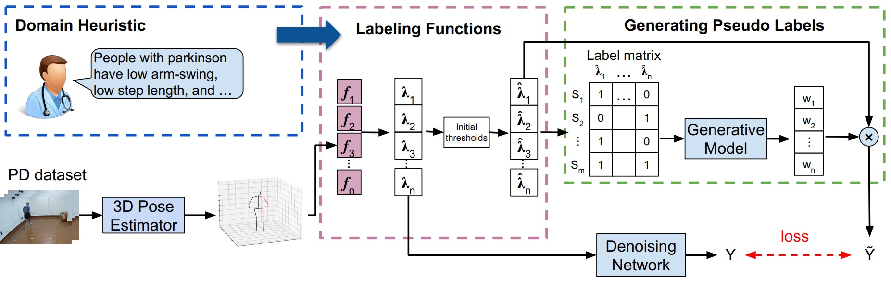

# PD_Gait_labeling
[](https://colab.research.google.com/drive/1GBSTHjqCJH60B0J_Ol3Zih8vTAFW_ptS?usp=sharing)
Implementation of "Automatic Labeling of Parkinson’s Disease Gait
Videos with Weak Supervision". 

<p align="center">.

<p/>

# Environment
Required packages:
<ul>
  <li>pytorch</li>
  <li>pytorch3d</li>
  <li>snorkel</li>
</ul> 

To install pytorch3d please follow the instructions at <br>https://github.com/facebookresearch/pytorch3d/blob/master/INSTALL.md
<br>To install snorkel please follow the instructions at <br>https://www.snorkel.org/get-started/ 

# 3D Humna Pose 

First train the 3D pose estimator on on Human3.6M dataset. Please first download the data from <a href="https://drive.google.com/drive/folders/1YnIYQldiPAphX3gI4yzmbKPeSL_kiD6p?usp=share_link">here</a> and put in the ```/data``` directory.
```
python train.py
```

Then you need to fine-tune the pose estimator on your mulri-view data. We can not provide our PD data due to the privacy issues. You can use your own data to train the network. Instrucitons on preparing custom data will be added.
```
python train_PD.py
```
